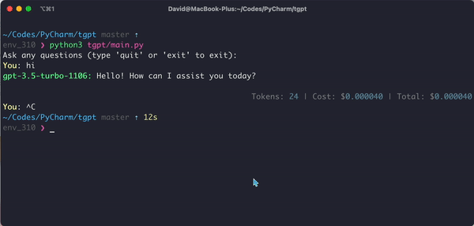

# tgpt



## Overview

A simple python script for chatting with ChatGPT from the command line, using the official API.

## Installation

```shell
git clone git@github.com:shwezhu/tgpt.git
cd tgpt
pip install -r requirements.txt
```

Add the OpenAI API key to your `.bashrc` file in the root of your home folder (`.zshrc` if you use zsh).

```shell
export OPENAI_API_KEY="YOUR_OPENAI_API_KEY"
```

## Usage

```shell
cd tgpt
./tgpt.py
# python3 ./tgpt.py -ml -i  # multiple line and interactive mode
# python3 ./tgpt.py -t # translator mode
# python3 ./tgpt.py -r # reader mode
```

> Make sure the script executable: `chmod +x tgpt.py`

```shell
env_310 ❯ ./tgpt.py --help
Usage: tgpt.py [OPTIONS]
 
Options:
  -b, --bot TEXT     Set bot which will set the cheapest model for the
                     specified bot, available choices: gpt.
  -m, --multiline    Use the multiline input mode.
  -i, --interactive  Use the interactive mode.
  -t, --translator   Make the bot act as an English translator, spelling
                     corrector and improver.
  -r, --reader       Make the bot act as a reader.
  --help             Show this message and exit.
```